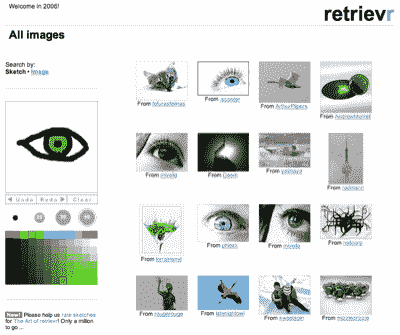
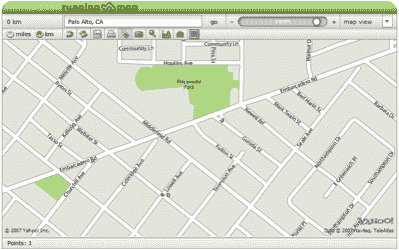
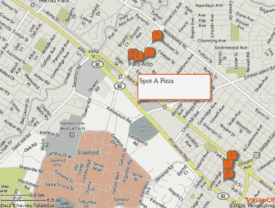

# 掀起一个雅虎！使用 PHP 的 Mashup

> 原文：<https://www.sitepoint.com/yahoo-mashup-php/>

那么，你想创建自己的混搭吗？太好了！混搭——从不同的外部来源获取信息并以新的令人兴奋的方式混合在一起的 web 应用程序——构建起来很有趣，很受用户欢迎，非常像 Web 2.0。

Web 服务是标准和数据格式的集合，它使 web 应用程序能够相互通信和共享数据，是 mashups 背后的核心技术。它们允许开发人员直接从数据库获取数据，而不必求助于杂乱的屏幕抓取，并使开发人员能够构建丰富的内容应用程序，使信息对用户更有用。

如今，许多公司为他们的各种 web 服务发布公共 API。在本文中，我将向您展示如何使用 Yahoo！用 PHP 5 构建混搭的 API。首先，我们将看看什么是 API，以及 Yahoo！我们可以加以利用。我将演示如何使用 Yahoo！的整个数据库，然后用 25 行 PHP 代码构建一个完整的应用程序来搜索“Palo Alto，CA”中的“Pizza”。

本教程假设您对 PHP 5 有一定的了解——特别是，您已经熟悉了基本语法、类和对象，并且对 web 服务有一些基本的了解。如果你认为你可能在这些方面有困难，看看维基百科关于网络服务的文章和 T2 网站的其他 PHP 教程。

##### 雅虎！开发者网络

[雅虎！开发者网络](http://developer.yahoo.com/)是所有 Yahoo！API 和一种与开发者联系的方式，使他们能够提供 Yahoo！-应用中的动力服务。查看它以获得更深入的参考信息。

***可用 API***

快速浏览一下开发者网络主页的侧边栏，你会发现雅虎有多少 API。提供。许多标准的雅虎！服务有公共 API 可用，比如[搜索](http://developer.yahoo.com/search)、[地图](http://developer.yahoo.com/maps/)和[答案](http://developer.yahoo.com/answers/)，每个 API 都有自己的一套文档。雅虎收购的许多初创公司。也为他们的服务提供 API，包括 [del.icio.us](http://del.icio.us/help/api/) 、 [Flickr](http://developer.yahoo.com/flickr/) 和[Upcoming.org](http://upcoming.yahoo.com/services/api/)，尽管这些 API 的处理方式各不相同——查看它们的文档以了解详细信息。这里有一个最流行的快速总结。

**Flickr**

Yahoo！提供的最流行的 API 之一。，Flickr 网络服务提供对 Flickr 上所有照片、照片元数据、标签等的访问。API 的流行用途包括在地图、画廊、海报和游戏上可视化位置。你可以在 [Flickr](http://www.flickr.com/services/) 服务页面上找到例子的链接，包括 [Retrievr](http://labs.systemone.at/retrievr/) ，这是一个图像搜索引擎，允许你搜索与你的手绘草图匹配的图像。



雅虎！地图

雅虎！maps API 非常强大，允许您创建具有高质量地理图像的交互式地图，为您的 web 应用程序增加了可视化位置的功能。API 的流行应用包括绘制旅程地图和定位用户。Runningmap.com 是雅虎的一个极好的例子地图应用编程接口，允许你绘制你的运动路线，检查你的距离和其他有趣的统计数据。



雅虎！搜索

想为你的网站建立一个搜索功能，或者添加相关链接到你的网络应用程序？Yahoo！的一个更传统的 API。搜索 API 允许对 Yahoo！网络搜索数据库。Christian Langreiter 在他的一个混搭中提供了雅虎和谷歌搜索结果的对比。


每个 API 都有不同的使用限制，所以在开始开发应用程序之前，请查阅相关指南。一些 API 有速率限制，例如，Web 搜索 API 被限制为每 24 小时每 IP 地址 5000 次查询。此外，并不是所有的 API 都可以用于商业目的。雅虎！要求开发人员向开发人员网络注册他们的应用程序，以接收应用程序 ID，并在他们向 API 发出的每个请求中包含这个应用程序 ID。虽然这些数据不影响速率限制，但它允许雅虎！监控 API 的使用，并在需要时联系开发者。您可以[获得一个应用程序 ID](http://search.yahooapis.com/webservices/register_application)——您将需要一个 ID 来试用本文中的示例代码。

##### 消费雅虎！蜜蜂

所有标准的雅虎！API 本质上是 RESTful 的。通过标准的 HTTP 请求访问数据，查询参数通过 URL 传递给 API。这意味着您可以像获取任何网页的 HTML 源代码一样轻松地从 API 获取数据，并且可以使用任何能够呈现 XML 的浏览器来测试请求。以此 URL 为例:

```
http://api.search.yahoo.com/WebSearchService/V1/webSearch?  

appid=YahooDemo&query=SitePoint&results=2
```

尝试一下— [在浏览器中访问 URL](http://api.search.yahoo.com/WebSearchService/V1/webSearch?appid=YahooDemo&query=SitePoint&results=2)并查看 XML 输出。然而，由于输出是 XML，我们需要用 PHP 解析响应 XML，以便利用它。许多类和 XML 解析函数对于 PHP 来说都是现成的，但是 Yahoo！更进一步:它提供了一个以序列化形式获取所有输出数据的选项。这意味着您可以快速获取数据，通过 [`unserialize`](http://php.net/unserialize) 功能运行数据，并立即开始处理数据。要获得 PHP 序列化的输出，只需将`&output=php`追加到查询字符串中。下面是一个简单的脚本，它使用 web search API 在 web 上搜索“SitePoint ”,只需要三行有效的代码:

```
<?php  

$output = file_get_contents(  

    'http://api.search.yahoo.com/WebSearchService/V1/'.  

    'webSearch?appid=your-app-id-here'.  

    '&query=SitePoint'.  

    '&results=2'.  

    '&output=php'  

);  

$output = unserialize($output);  

echo '<code>'.print_r($output,TRUE).'</code>';  

?>
```

检查这个代码片段，我们看到我们首先使用 [`file_get_contents`](http://php.net/file_get_contents/) 函数获取 PHP 格式的数据，然后用 unserialize 将它转换为关联数组，最后用`print_r`输出数组的转储。我应该在这里注意，要能够使用`file_get_contents`打开一个 URL，需要在`php.ini`中启用`allow_url_fopen`设置。如果你不确定这个设置是否到位，请咨询你的主机。让我们来看看输出。`$output['ResultSet']['Result']`包含我们正在寻找的数据。以下是第一个搜索结果的片段:

```
[Title] => SitePoint : New Articles, Fresh Thinking for Web Developers and Designers  

[Summary] => Network of sites that provice information, tools, and resources for internet-focused businesses and web developers, including WebmasterBase.com, eCommerceBase.com, and PromotionBase.com.  

[Url] => https://www.sitepoint.com/
```

将此结果与雅虎官方网站上搜索“SitePoint”的第一个结果进行比较。搜索网站，你会发现这是一样的。


你通常通过雅虎获得的所有数据！可以通过 API 进行搜索！忘记杂乱的屏幕抓取——雅虎！使得直接获得搜索结果变得容易。通过另外几行代码，我们可以将数组变成一个完整的搜索结果页面。你可能已经看到了如何用 Yahoo！网络搜索 API 在这里——就这么简单！从头开始构建自己的搜索引擎通常需要购买一个数据中心，并花费数年时间在网上搜索。免费提供所有数据(当然有使用限制)。你可能听说过[rollyo.com](http://rollyo.com)，一个让你创建搜索引擎的网站。嗯，Rollyo 是使用 Yahoo！API。只需几行 PHP 代码，我们就可以查询 Yahoo！web 搜索 API，解析 API 输出，提取数据，格式化并输出数据——这是一项唾手可得的强大功能。

雅虎的大部分！API 和网络搜索一样容易使用。如果您需要关于从 API 获取数据的更多信息，提供一个关于构造 REST 查询的[指南。每个 API 方法都有一个文档页面，概述了可用的参数、返回值、可能的输出格式(XML、PHP 等。)和潜在的错误。需要注意的是，所有的参数都是 URL 编码的，所以`php code`应该变成`php+code`，否则 API 可能会返回意外的输出。PHP 内置的](http://developer.yahoo.com/search/rest.html) [`urlencode`](http://php.net/urlencode) 函数足以完成这项任务。一般来说，每个服务都有一个基本 URL，如下所示:

```
http://api.search.yahoo.com/WebSearchService/V1/webSearch
```

每个服务都需要某些参数，其中一个是您的应用程序 ID，大多数服务都有一个查询参数。在前面的示例搜索中，我们使用了参数`appid`、`query`、`results`和`output`。在这种情况下，`appid`是应用程序 ID，`query`是我们要搜索的内容(“站点点”)，而`output`是我们想要的 API 输出格式(`php`是序列化的 PHP 格式，可选)。`results`参数是可选的，但是我在这里使用它将输出限制为两个搜索结果，以减少服务器负载。如果您不需要标准的 10 个结果，通过 results 参数限制输出是非常可取的。我们将一个问号和参数附加到 URI，用一个&符号(`&`)分隔每个参数，并使用标准的`option=value`格式，就像任何其他 HTTP 请求一样。

现在你已经对雅虎的用法有了一个温和的介绍。API，它们的行为方式以及它们提供的访问权限，让我们更进一步，看看我们实际上如何很好地使用这些 API。

##### PHP 5 和雅虎！蜜蜂

PHP 5 有许多特性可以帮助我们有效地使用 Yahoo！API。PHP 5 改进的内部 OOP 支持使开发人员能够高效地构建应用程序，我们可以通过使用类来快速开发利用 Yahoo！API。`file_get_contents`函数的引入使得查询 API 变得容易，正如我之前提到的，PHP 还有一个额外的优势，它可以从大多数内置解析函数的 API 接收序列化输出。尽管 PHP 5 中提供了 [HTTP 扩展](http://php.net/manual/en/ref.http.php)，但我们不需要它来进行低端 API 消费。PHP 5 开发人员可以很容易地查询 API、解析输出、处理错误和利用数据，而不会有太多麻烦。

***快捷简单的混搭***

为了展示雅虎的力量！API，我们将使用 PHP 5 和各种 Yahoo！API。我们想要做的是查询本地搜索 API，从 Yahoo！Local，用户在这里讨论和评价当地的景点、商家等等。然后我们将这些数据放在地图上，显示这些景点的地理位置。

PHP 5 中的 YahooAPI 客户端类

为了使我们的生活更容易，我们将使用一个 PHP 类来帮助我们查询 Yahoo！API。基类需要具有以下功能:

*   设置要使用的 web 服务。
*   向请求添加参数。
*   执行对远程 API 的调用。
*   获取输出。

为此，我构建了一个非常简单、可扩展的类，名为`YahooAPI`——请看本文的[代码档案。虽然我不会深入讨论`YahooAPI`类的细节，但是使用它非常容易。在前面的例子中，我们在 Web 上搜索“SitePoint”。使用类可以非常容易地完成相同的任务:](https://www.sitepoint.com/examples/yahooapi/YahooAPIarchive.zip)

```
$api = new YahooAPI();  

$api->setAppID('your-app-id-here');  

$api->setService('http://api.search.yahoo.com/WebSearch  

Service/V1/'.  

    'webSearch');  

$api->setParam('output','php');  

$api->setParam('query','SitePoint');  

$api->setParam('results','2');  

$output = $api->doAPICall();
```

这与前面的搜索示例完全相同，只是现在我们使用了 client 类。在这种情况下，使用类会更加冗长，但是由于对 API 的调用更加复杂和重复，使用类可以节省时间并简化维护。

**从 API 调用中操纵数据**

现在我们已经拥有了工作所需的一切，我将向您展示如何轻松地从 Yahoo！API。

让我们使用新的 YahooAPI 类，通过本地搜索 API 来搜索“Palo Alto，CA”中的“Pizza”。查看文档页面中的[获取最新版本的本地搜索 API。这是服务的基本 URL:](http://developer.yahoo.com/search/local/V3/localSearch.html)

```
http://local.yahooapis.com/Local  

SearchService/V3/localSearch
```

所以我们将调用`YahooAPI`类的`setService`方法，并给它一个基本 URL。查看文档中的请求参数，我们需要提交`'appid'`、`'query'`和`'location'`参数。在我们设置了所需的应用程序 ID 之后，我们需要选择一个位置——我们现在使用一个城市和州——以及一个查询。比方说，我们正在“加州帕洛阿尔托”搜索“比萨饼”。在使用`YahooAPI`类的简单的、过程化的 PHP 代码中，搜索将如下所示:

```
$api = new YahooAPI();  

$api->setService('http://local.yahooapis.com/LocalSearch  

Service/V3/'.  

    'localSearch');  

$api->setAppID('your-app-id-here');  

$api->setParam('output','php');  

$api->setParam('query','pizza');  

$api->setParam('location','Palo Alto, CA');  

$output = $api->doAPICall();
```

这里对 API 的调用与获取是一样的

```
http://local.yahooapis.com/LocalSearch  

Service/V3/localSearch?appid=your-app-id-here&  

query=pizza&location=Palo+Alto,+CA
```

通过任何方法，所以看看你的网页浏览器的网址。显然，我们要寻找的信息在每个`<Result>`节点中，所有的`<Result>`节点都在一个大的`<ResultSet>`节点中。我们正在获取的 PHP 版本与 XML 具有完全相同的结构，只是它是在一个易于使用的数组中。在将所有数据获取到`$output`变量中之后，我们所要做的就是迭代`$output['ResultSet']['Result']`元素并获取我们需要的数据。尝试一下——在前面的示例后添加以下代码，并在您的 web 服务器上运行它:

```
foreach($output['ResultSet']['Result'] as $result) {  

  echo $result['Title'].'<br/>';  

}
```

您应该会收到类似以下输出的内容:

```
Patxi's Chicago Pizza  

Papa Murphys Pizza Take & Bake  

New York Pizza  

Round Table Pizza Palo Alto  

Domino's Pizza  

California Pizza Kitchen  

Pizza My Heart  

Ramonas Pizza  

Round Table Pizza Palo Alto  

Spot A Pizza
```

**`LocalSearch`PHP 5 中的客户端类**

现在让我们扩展`YahooAPI`类来查询 Yahoo！本地搜索 API。我们可以很容易地创建一个类来为我们管理所有这些工作。如果我们扩展`YahooAPI`类并创建一些适当命名的方法——例如`locationSearch($query, $location)`,而不是前面的过程代码，我们可以进一步简化与 API 交互的过程。

我已经编写了一个示例类，它涵盖了我们与本地搜索 API 交互所需的所有内容。它主要有三种方法:`locationSearch`、`positionSearch`、`extractResults`。代码如下:

```
<?php   

require_once('yahooapi.class.php');   

class LocalSearch extends YahooAPI   

{
```

构造函数方法为每个本地搜索 API 请求设置我们总是需要的基本属性:

```
 public function __construct()   

  {   

    $this->setParam('output','php');   

    $this->setService('http://local.yahooapis.com/'.   

        'LocalSearchService/V3/localSearch');   

    $this->setAppID('your-app-id-here');   

  }
```

这两种搜索方法代表了执行搜索的不同方式，这取决于我们是否有位置名称或精确的 GPS 坐标。他们只需设置所需的参数并调用父类`YahooAPI`的`doAPICall`方法:

```
 public function locationSearch($query,$in_location)   

  {   

    $this->setParam('query',$query);   

    $this->setParam('location',$in_location);   

    return $this->doAPICall();   

  }   

  public function positionSearch($lat,$long)   

  {   

    $this->setParam('query','*');   

    $this->setParam('latitude',$lat);   

    $this->setParam('longitude',$long);   

    return $this->doAPICall();   

  }

The extractResults method saves us entering ['ResultSet']['Result'] all the time when we want to output the results, because the data we need will always be within that part of the returned array:
```

```
 public function extractResults()   

  {   

    $return = $this->getResults();   

    $return = $return['ResultSet']['Result'];   

    return $return;   

  }   

}   

?>
```

您将在文章的归档文件[中找到代码的副本。将它放在手边，因为我们将在示例混搭中使用它。稍后我们还将为 Maps API 构建一个类似的类，因为它有一些稍微不同的需求。](https://www.sitepoint.com/examples/yahooapi/YahooAPIarchive.zip)

我们的示例“pizza”搜索使用新的`LocalSearch`类执行，现在看起来像这样:

```
require_once('localsearch.class.php');   

$localSearch = new LocalSearch();   

$localSearch->locationSearch('Pizza','Palo Alto, CA');   

$output = $localSearch->extractResults();
```

那就简单多了，你不觉得吗？

雅虎！地图 AJAX API

进行快速网络搜索，你可以找到这些比萨饼店的网站，每个网站都会列出餐馆的地址。但为什么你会去所有的麻烦，当雅虎！在返回的数组中提供所有这些数据——以及经度和纬度信息？以下是返回数据的示例:

```
[Title] => Patxi's Chicago Pizza   

[Address] => 441 Emerson St   

[City] => Palo Alto   

[State] => CA   

[Phone] => (650) 473-9999   

[Latitude] => 37.445265   

[Longitude] => -122.163432
```

现在我们有了位置信息，我们需要弄清楚如何在地图上绘制它。雅虎！提供了一个地图图像 API，提供 PNG 格式的原始地图图像，并且(理论上)我们可以使用 GD 在地图上绘制标记。然而，由于我们正在构建一个 web 应用程序，我们可以使用 [Maps AJAX API](http://developer.yahoo.com/maps/ajax/index.html) 来生成一个 UI 友好的交互式 Yahoo！地图显示。然后，我们可以使用捆绑的函数在地图的预设位置添加标记。(注意，地图 Ajax API 并不是真正的 AJAX API！事实上，根本没有真正的 Ajax——也就是说，没有 XMLHttpRequest 调用——但是由于 Ajax 这个术语已经代表了任何使用 JavaScript 的网页技术，并且不需要重新加载网页来更新自己，所以 Ajax 是描述它的最佳方式。)

不像其他雅虎！Maps AJAX API 不是基于 REST 的 web 服务。相反，您必须在页面上包含一个 JavaScript 文件，在页面上的容器(通常是一个`<div>`)中创建一个地图实例，并通过 JavaScript 调用操纵它。幸运的是，所需的 HTML 和 JavaScript 非常简单。看看[代码档案](https://www.sitepoint.com/examples/yahooapi/YahooAPIarchive.zip)中的`mapoutput.php`例子。这是生成地图所需的全部 JavaScript 代码:

```
var ymap = new YMap(document.getElementById('mC'),YAHOO_MAP_REG);   

var mPoint = new YGeoPoint(37.4041960114344,-122.008194923401);   

ymap.drawZoomAndCenter(mPoint, 3);   

var marker = new YMarker(mPoint);   

marker.addLabel('A');   

marker.addAutoExpand('<div class="mp">Some Text</div>');   

ymap.addOverlay(marker);
```

第一行创建了一个`YMap`类的新实例，并将其分配给页面上 ID 为`'mC'`的元素。第二个参数表示所需的地图类型，在本例中是常规地图而不是卫星图像，`YAHOO_MAP_SAT`，或者是两者的混合，`YAHOO_MAP_HYB`。第二行创建一个`YGeoPoint`对象，一个基于纬度和经度坐标的地图上的点，而第三行调用地图对象，告诉它以这个新的点为中心，以 3 倍的缩放比例显示地图。

JavaScript 的最后三行创建了一个`YMarker`对象，这是一个可视的地图标记，当鼠标经过时，它会展开以显示一些额外的内容。我们的挑战是用 PHP 生成所有这些，为了使这项工作变得简单，我们将构建一个为我们生成所有代码的类。

##### 混搭时间！

既然我们已经解决了如何查询 API 和处理数据的问题，现在是 mashup 的时候了！正如我前面提到的，我们将创建一个简单的应用程序，它使用本地搜索 API 查找地点，并使用返回的搜索数据中的纬度和经度坐标，从 maps API 在地图上标记这些地点的确切位置。当然，我们将把所有的功能包装在一个简单的 PHP 类中。AJAX map API 使用 JavaScript 代码，因此我们将使用 PHP 类根据返回的搜索数据生成所需的 JavaScript。

首先，我们将从查询 Maps API 开始。我将使用本地搜索 API 的客户端类来执行这个示例查询:“Pizza ' in ' Palo Alto，CA”。我们需要一个`LocalSearch`类的实例，我们将使用它的 locationSearch 方法来执行 API 查询。`extractResults`方法会给我们想要处理的数据。现在我们已经构建了我们的客户端类，所有这些都可以通过三行代码来实现:

```
$localSearch = new LocalSearch();   

$localSearch->locationSearch('Pizza','Palo Alto, CA');   

$apiOutput = $localSearch->extractResults();
```

让我们暂时退一步，调用`print_r($apiOutput)`看看我们有什么。数组`$apiOutput`现在包含许多子数组，每个子数组都是一个搜索结果，包含“标题”、“纬度”和“经度”等内容。这就是我们目前所需要的，所以让我们快速提取这些信息并删除其余的:

```
foreach($apiOutput as $id => $result)   

{   

  $points[$id] = array($result['Title'],   

      $result['Latitude'],   

      $result['Longitude']);   

}
```

以下是我们新定义的`$points`数组中的一些样本值:

```
[0] => Array   

(   

  [0] => Patxi's Chicago Pizza   

  [1] => 37.445265   

  [2] => -122.163432   

)   

[1] => Array   

(   

  [0] => Papa Murphys Pizza Take & Bake   

  [1] => 37.433243   

  [2] => -122.129291   

)
```

对于我们想要放在地图上的每个标记，我们需要知道它的位置，并且我们需要一些摘要文本，当用户将鼠标放在它上面时可以显示出来。在这种情况下，当访问者将鼠标放在我们的标记上时，我们会向他们显示该地点的名称。

现在我们已经有了所有的位置信息，接下来是棘手的部分——生成地图 HTML 和 JavaScript。基本上，我们的地图代码由两个不同的部分组成——`<head>`HTML 和 CSS(用于地图容器),以及`<body>` HTML 和 JavaScript。`<body>`包括地图容器`<div>`和地图 AJAX API 的一些 JavaScript。对于我们想要添加到地图上的每个标记，我们需要一个 JavaScript `YGeoPoint`对象来定义它的位置，一个`YMarker`对象作为标记本身。然后我们通过`addLabel`和`addAutoExpand`方法定制标记(更多的[记录在这里](http://developer.yahoo.com/maps/ajax/V3/reference.html#YMarker))，然后使用地图对象的`addOverlay`方法将其放置在地图上。我们现在将创建一个负责生成所有 JavaScript 代码的 PHP 类，并将其命名为`AjaxMap`。

下面是我们的类将拥有的方法的总结:

*   `getHeadHTML`用于生成`<head>`代码
*   `getMapScript`用于生成`<body>`代码
*   `initMarker`为每个标记生成代码

我们还将添加一些自定义地图的辅助方法:

*   `setMapType`用于在地图、卫星图像和混合图像之间进行选择
*   `setMapContainer`用于设置地图容器的 ID`<div>`
*   `addMarker`为地图添加标记

让我们开始上课吧:

```
<?php    

require_once('yahooapi.class.php');    

class AjaxMap    

{    

  private $mapContainer;    

  private $mapType;     

  private $markers = array();     

  public $showZoom;     

  public $showPan;
```

我们从包含`YahooAPI`类开始，我们将使用它来生成 Yahoo！API 调用。我们的类有三个私有属性:`$mapContainer`将包含充当地图容器的 HTML 元素的 ID，`$mapType`将表示所需的地图类型，并且必须是`YAHOO_MAP_REG`、`YAHOO_MAP_SAT`或`YAHOO_MAP_HYB`中的一个，最后一个私有属性`$markers`将包含地图位置标记的数组。API 提供了添加缩放和平移控件的能力，所以我们将添加公共属性`$showZoom`和`$showPan`，需要时可以将它们设置为`true`。

所以，先来简单的方法:`getHeadHTML`、set 函数和`addMarker`。所有的`getHeadHTML`方法需要做的就是返回一个引用 Yahoo！AJAX 地图 API:

```
public function getHeadHTML()    

  {    

    return '<script type="text/javascript" '.    

        'src="http/api.maps.yahoo.com/ajaxymap?v=3.0&appid=your-app    

        -id-here">'.    

        "</script>n";    

  }
```

set 函数同样简单——它们充当修改私有属性的包装方法。代码如下:

```
 public function setMapContainer($id)    

  {    

    $this->mapContainer = $id;    

  }    

  public function setMapType($type)    

  {    

    $this->mapType = $type;    

  }
```

`addMarker`方法将向私有$markers 数组添加一个新的地图标记条目，并以纬度值、经度值和描述文本作为其参数:

```
 public function addMarker($lat,$long,$descr)    

  {    

    $this->markers[] = array($lat,$long,$descr);    

  }
```

```
initMarker is a private method called for each of the desired map markers and generates the JavaScript code required for the marker:
```

```
 private function initMarker($id,$lat,$long,$descr,$init_geo = TRUE)    

  {    

    $js = '';    

    if($init_geo) $js .= "nvar mPoint$id = ".    

        "new YGeoPoint($lat,$long);n";    

    $js .= "var currmarker = new YMarker(mPoint$id);n";    

    $js .= "currmarker.addLabel('$id');n";    

    $js .= "currmarker.addAutoExpand('<div class="mp">".    

        addslashes($descr)."</div>');n";    

    $js .= "ymap.addOverlay(currmarker);nn";    

    return $js;    

  }
```

```
initMarker takes all the information about the marker -- latitude and longitude for position, a short description and some notes, plus a unique 'id' parameter -- and generates the JavaScript we need in order to draw the marker. The $init_geo parameter for initMarker indicates whether or not we need to create a YGeoPoint object for the marker; this may already have been done.
```

剩下要做的就是把所有的东西都放在主 JavaScript 块中。`getMapScript`方法将生成这个 JavaScript 并将其分配给`$js`变量:

```
 public function getMapScript()    

  {    

    $js = '';
```

首先，我们必须初始化一个`YMap`对象。这是我们的主地图对象，它将处理地图的绘制和定制。第一部分很简单——我们输出创建新的`YMap`对象所需的代码:

```
 $js .= 'var ymap = new YMap(document.getElementById(''.    

        $this->mapContainer.''),'.$this->mapType.");n";
```

在这种情况下，属性`$mapContainer`和`$mapType`包含了地图的相关信息，所以`setMapType`和`setMapContainer`应该在`getMapScript`之前被调用。

接下来，如果`$showZoom`和`$showPan`被设置为`true`，我们输出 JavaScript 来添加缩放和平移控件。为了在 JavaScript 中添加缩放控件，我们使用了`YMap`对象的`addZoomShort`方法，以及用于平移控件的`addPanControl`:

```
 if($this->showZoom) $js .= "ymap.addZoomShort();n";    

    if($this->showPan) $js .= "ymap.addPanControl();n";
```

我们可能有许多标记要显示，但地图只能以其中一个为中心。为了简单起见，我们将从主标记集中移除最后一个标记，将地图居中并在地图上绘制，然后继续绘制剩余的标记。显然，如果地图上没有要画的标记，这些都是不需要的，所以我们检查这里是否也有标记。下面是输出将地图居中于最后一个标记并绘制该标记所需的 JavaScript 的代码:

```
 if(count($this->markers) > 0)    

    {    

      $lastmarker = array_pop($this->markers);    

      $js .= 'var mPoint'.count($this->markers).' = new YGeoPoint('.    

          $lastmarker[0].','.$lastmarker[1].");n";    

      $js .= 'ymap.drawZoomAndCenter(mPoint'.count($this->markers).    

          ", 3);n";    

      $js .= $this->initMarker(count($this->markers), $lastmarker[0],    

          $lastmarker[1], $lastmarker[2],    

          FALSE);
```

首先，我们检查是否有超过`0`的标记(也就是说，我们查看是否设置了任何标记)，如果是，提取这些标记中的最后一个，并使用该标记的数据编写创建新的`YGeoPoint`对象所需的 JavaScript。然后，我们输出绘制地图所需的 JavaScript，将其置于最后一个标记的中心，并将缩放级别设置为 3。在 JavaScript 中，我们通过`YMap`对象的`drawZoomAndCenter`方法来实现。然后我们调用我们的`initMarker`函数来生成剩下的 JavaScript，并通过它的最后一个参数，告诉它不要输出 JavaScript 来创建一个`YGeoPoint`对象，因为我们已经处理好了。

最后，我们通过快速迭代标记数组，为每个剩余的标记生成代码，为每个标记调用`initMarker`并返回`$js`字符串变量:

```
 foreach($this->markers as $id=>$obj)    

      {    

        $js .= $this->initMarker($id,$obj[0],$obj[1],$obj[2],TRUE);    

      }    

    }    

    return $js;    

  }    

}    

?>
```

那也代表着我们`AjaxMap`班的结束！

现在我们只需要在适当的应用程序中使用我们的本地搜索类和`AjaxMap`类。我做了一个快速演示。首先，我们需要包含我们的两个类:

```
<?php    

require_once('localsearch.class.php');    

require_once('ajaxmap.class.php');
```

接下来，我们使用本地搜索类来搜索“pizza”。我们从搜索结果中收集位置，并将它们存储在一个名为`$points`的数组中:

```
$localSearch = new LocalSearch();    

$localSearch->locationSearch('Pizza','Palo Alto, CA');    

$apiOutput = $localSearch->extractResults();    

foreach($apiOutput as $id => $result)    

{    

  $points[$id] = array($result['Title'],    

      $result['Latitude'],    

      $result['Longitude']);    

}    

unset($apiOutput);
```

然后，我们创建一个新的`AjaxMaps`对象，并将我们所有的位置添加到其中:

```
$ajaxMap = new AjaxMap();    

$ajaxMap->setMapContainer('mC');    

$ajaxMap->setMapType('YAHOO_MAP_REG');    

$ajaxMap->showPan = true;    

$ajaxMap->showZoom = true;    

foreach($points as $point)    

{    

  $ajaxMap->addMarker($point[1],$point[2],$point[0]);    

}    

?>
```

现在所有的位置标记都已经添加到了我们的`AjaxMap`对象中，剩下的唯一任务就是编写页面 HTML 并输出 JavaScript:

```
<!DOCTYPE html public "-//W3C//DTD XHTML 1.0 Transitional//EN"    

  "https://www.w3.org/TR/xhtml1/DTD/xhtml1-transitional.dtd">    

<html >    

  <head>    

  <?php echo $ajaxMap->getHeadHTML(); ?>    

    <style>    

      #mC {    

        height: 500px;    

        width: 500px;    

      }    

      .mp {    

        width:160px;    

        height:50px;    

      }    

    </style>    

  </head>    

  <body>    

    <div id="mC"></div>    

    <script type="text/javascript">    

    <?php echo $ajaxMap->getMapScript(); ?>    

    </script>    

  </body>    

</html>
```

代码档案中提供了整个脚本。设置您的应用程序 id，将其加载到您的 web 服务器上，如果幸运的话，您应该会看到如下内容:



恭喜你！您刚刚使用 Yahoo！API。稍加调整，你就可以添加搜索功能，让用户不只是在“加州帕洛阿尔托”寻找“比萨饼”。您甚至可以将该功能集成到现有的应用程序中(尽管要注意这两种 API 的使用条款)。可能性是无限的。

##### 从这里去哪里？

如你所见，利用雅虎！用 PHP5 的 API 创建有用的 mashups 是小菜一碟，有许多有趣的应用程序可以用这些数据来构建。拉斯马斯·勒德尔夫本人也写了一篇类似的文章，对雅虎进行了更深入的研究。地理编码 API，以及如何在 PHP5 中轻松使用它。同样值得注意的是，虽然我们在本文中使用了`output=php`参数，但是大多数 API 也提供了 JSON 输出，以便通过 Ajax 使用。[雅虎！Developer Network 的 PHP 开发中心](http://developer.yahoo.com/php/)有一个很好的教程、代码样本和其他资源的集合，可以用来使用 PHP5 的 API。

还可以查看一下雅虎的应用程序库，寻找灵感，看看用各种雅虎创建的一些很棒的网络应用程序。API，如果你构建了一个有趣的应用程序，把它提交到 gallery 来获得一些优秀的曝光和有用的反馈。

更新:Zend PHP 框架也包含了一系列类似的面向对象的接口。API，这在很多情况下可能比开发自己的类更好。这些接口位于框架的 [Zend_Service 包](http://framework.zend.com/manual/en/zend.service.yahoo.html)中。

## 分享这篇文章