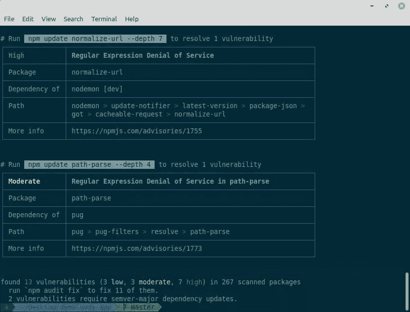

# 纱线 vs npm:你需要知道的一切

> 原文：<https://www.sitepoint.com/yarn-vs-npm/>

在本教程中，我们将比较 Yarn 和 NPM——两种最流行的包管理器。我们将并排设置它们，并探讨它们各自的优缺点，以帮助您选择哪一个用于您的项目。

## 奠定基础

回到过去，一个简单的文本编辑器足以让开发人员创建和管理他们项目的大部分。但是从那以后，网络发生了巨大的变化。如今，即使是一个相当简单的项目，拥有数百或数千个脚本也是很常见的，这些脚本具有复杂的嵌套依赖关系，如果没有某种自动化工具，根本不可能管理这些脚本。这就是包管理器发挥作用的地方。

一个**包管理器**是一个以多种方式自动处理项目依赖关系的工具。例如，在包管理器的帮助下，我们可以安装、卸载、更新和升级包，配置项目设置，运行脚本，等等。所有艰难而乏味的工作都由包管理器完成，留给我们的只有有趣的部分——编码本身。

[**npm**](https://docs.npmjs.com/cli/v7/commands/npm) 代表节点包管理器。它发布于 2010 年，开启了 web 开发的新时代。在此之前，项目依赖项是手动下载和管理的。npm 是将网络推向下一个层次的魔棒。

npm 实际上涉及三件事:

*   一个*网站*，用于管理你的 npm 体验的各个方面
*   一个*注册表*,用于访问 JavaScript 包的大型公共数据库
*   用于通过终端与 npm 交互的*命令行界面* (CLI)

然而，当大多数人谈论 npm 时，他们通常指的是最后一个工具 CLI 工具。它作为默认的软件包管理器随每个新节点安装一起提供。这意味着你可以马上开始使用它。

如果你想深入了解 npm，请参考我们的[节点包管理器指南](https://www.sitepoint.com/npm-guide/)。

[**纱**](https://yarnpkg.com/) 代表又一个资源谈判者。纱线包装管理器是脸书于 2016 年 10 月发布的 npm 的替代产品。Yarn 最初的目标是处理 npm 的缺点，比如性能和安全问题。Yarn 很快被定位为一个安全、快速、可靠的 JavaScript 依赖管理工具。

但是 npm 团队吸取了教训，通过实现缺失的功能迅速填补了 npm 的空白。

让我们快速穿越时间，看看大图:

*   2010 年:发布支持节点的 npm。
*   2016 年:纱线发布。它表现出比 npm 更好的性能。它还生成一个`yarn.lock`文件，使得回购的共享和精确复制更加容易和可预测。
*   2017 年:npm 5 发布。它提供自动生成一个`package-lock.json`文件来回答`yarn.lock`。
*   2018: npm 6 发布，安全性提升。现在，npm 会在安装依赖项之前检查安全漏洞。
*   2020 年:纱 2 和 npm 7 发布。这两个包都有很棒的新特性，我们将在本教程的后面看到。
*   2021 年:纱线 3 发布，有各种改进。

现在，这两个包管理器在包管理竞赛中并驾齐驱，提供相似的特性和功能。但是仍然有几个差异有助于确定我们选择使用哪一个。

在本教程的其余部分，我们将探讨 npm 和 Yarn 之间的主要相似之处和不同之处。

## Yarn vs npm:安装比较

我们将从 npm 和 Yarn 的安装过程开始我们的对比探索。

### 安装软件包管理器本身

正如我上面提到的，npm 预装了 Node，所以没有必要手动安装 npm。

相比之下，Yarn 需要显式安装。首先，我们需要在全球范围内安装纱线:

```
npm install -g yarn 
```

然后，我们可以通过在我们的项目中设置所需的版本，在每个项目的基础上使用它。我们通过在项目的根目录中运行`yarn set version`命令来实现这一点:

```
yarn set version berry 
```

在这种情况下，`berry`就是我们要设置的版本。

如果我们想更新到最新版本，我们运行这个:

```
yarn set version latest 
```

有了 Yarn，我们可以为每个项目使用不同的版本。

要对 npm 做同样的事情，您需要安装 [nvm(节点版本管理器)](https://github.com/nvm-sh/nvm)。下面介绍如何[使用 nvm](https://www.sitepoint.com/quick-tip-multiple-versions-node-nvm/) 安装多个版本的 Node。

### 安装项目依赖项

现在，让我们看看项目依赖项是如何安装的。

当我们运行`npm install`时，依赖项被依次安装，一个接一个。终端中的输出日志信息丰富，但有点难以阅读。

为了安装带有 Yarn 的包，我们运行`yarn`命令。Yarn 并行安装包，这是它比 npm 更快的原因之一。如果您使用的是 Yarn 1，您将会看到 Yarn 输出日志是干净的、视觉上可区分的和简短的。为了便于理解，它们还以树形排列。但是这在版本 2 和版本 3 中有所改变，在版本 2 和版本 3 中，日志不是那么直观和易读。

到目前为止，我们已经看到 npm 和 Yarn 有不同的安装包的命令。在下一节中，我们将探索更多的命令。

## 比较 npm 和 Yarn 命令

npm 和 Yarn 共享许多命令，但是也有许多不相同的命令。让我们首先探索一些相同的命令:

*   `npm init` | `yarn init`:新建一个包
*   `npm run` | `yarn run`:运行`package.json`中定义的脚本
*   `npm test` | `yarn test`:测试一个包
*   `npm publish` | `yarn publish`:发布一个包
*   `npm cache clean` | `yarn cache clean`:从缓存文件夹中删除所有数据

这些命令使得在两个管理器之间切换变得容易，但是有一些不相同的命令会引起混淆。让我们看看下一个列表中的内容:

*   `npm install` | `yarn`:安装依赖项
*   `npm install [package]` | `yarn add [package]`:安装包
*   `npm install --save-dev [package]` | `yarn add - -dev [package]`:安装一个包作为开发依赖
*   `npm uninstall [package]` | `yarn remove [package]`:卸载一个包
*   `npm uninstall --save-dev [package]` | `yarn remove [package]`:卸载开发依赖包
*   `npm update` | `yarn upgrade`:更新依赖关系
*   `npm update [package]` | `yarn upgrade [package]`:更新一个包

Yarn 也有一些独特的命令，这些命令没有 npm 的等价物。例如，`why`命令显示了需要一个包的原因:它可能是一个依赖项、一个本机模块或一个项目依赖项。

## 纱线与非织造布:速度和性能

每当 Yarn 或 npm 需要安装一个包时，它们会执行一系列任务。在 npm 中，这些任务是针对每个包按顺序执行的，这意味着它将等待一个包完全安装后再继续下一个包。相反，Yarn 并行执行这些任务，提高了性能。

虽然这两个管理器都提供了缓存机制，但 Yarn 似乎做得更好。通过实现零安装范例，正如我们将在特性比较一节中看到的，它几乎可以立即安装软件包。它缓存每个包并保存在磁盘上，所以在这个包的下一次安装中，你甚至不需要有互联网连接，因为这个包是从磁盘离线安装的。

尽管 Yarn 有一些优势，但是 Yarn 和 npm 的速度在它们的最新版本中是相当的。所以我们不能在这里定义一个干净的赢家。

## Yarn vs npm:安全性比较

对国家预防机制的主要批评之一是关于安全。以前的 npm 版本有几个严重的安全漏洞。

从版本 6 开始，npm 会在安装过程中审核软件包，并告诉您是否发现了任何漏洞。我们可以通过对已安装的包运行`npm audit`来手动检查。如果发现任何漏洞，npm 将向我们提供安全建议。



正如你在上面的截图中看到的，我们可以运行`npm audit fix`来修复包漏洞，如果可能的话，依赖树将被修复。

Yarn 和 npm 都使用[加密哈希算法](https://en.wikipedia.org/wiki/Cryptographic_hash_function)来确保包的完整性。

## Yarn vs npm:特征比较

就像命令一样，npm 和 Yarn 共享一些特性，但也有一些不同。让我们首先探索这两个包管理器共有的特性。

### 生成锁定文件

在`package.json`文件中，npm 和 Yarn 都记录了项目的依赖关系，版本号并不总是精确的。相反，您可以定义一系列版本。这样，您可以选择一个包的特定主版本和次版本，但允许 npm 安装可能修复一些错误的最新补丁。

在语义版本化的理想世界中，打补丁的版本不会包含任何突破性的变化。但不幸的是，情况并非总是如此。npm 采用的策略可能会导致两台机器使用相同的`package.json`文件，但是安装了不同版本的软件包——这可能会引入 bug。

为了避免软件包版本不匹配，一个精确的安装版本被固定在一个软件包锁定文件中。每次添加一个模块，npm 和 Yarn 分别创建(或更新)一个`package-lock.json`和`yarn.lock`文件。这样，您可以保证另一台机器安装完全相同的包，同时仍然拥有在`package.json`中定义的一系列允许的版本。

### 使用工作区

工作区允许你用一个 [monorepo](https://www.sitepoint.com/monorepo-nx-next-typescript/) 来管理多个项目之间的依赖关系。这意味着您有一个单一的、顶层的根包，它有多个称为工作区的子包。

### 远程运行脚本

`npx`命令用于运行来自`./node_modules/.bin`的脚本。它还允许您从 npm 注册表中执行包，而无需将它们安装在项目依赖项中。例如，您可以通过运行以下命令创建一个新的 React 应用程序:

```
npx create-react-app my-app 
```

在 Yarn 中，您可以通过使用等效的`dlx`命令获得相同的结果:

```
yarn dlx create-react-app my-app 
```

我们将要探索的其他特性是 Yarn 独有的。

### 零安装

Zero installs 将缓存存储在项目目录的一个`.yarn`文件夹中。当你使用`yarn`或`yarn add <package>`等命令时，Yarn 会创建一个`.pnp.cjs`文件。该文件包含 Node 用来加载项目包的依赖关系层次结构。因此，您几乎可以随时访问它们。

### 即插即用

即插即用是另一种安装策略。Yarn 没有生成一个`node_modules`目录并将解析留给 Node，而是生成一个单独的`.pnp.cjs`文件，将包映射到它们在磁盘上的位置以及它们的依赖项列表。这个特性可以导致更快的项目启动，更好的优化依赖树，更快的安装时间，当然也消除了对`node_modules`文件夹的需求。

### 执照

Yarn 打包了一个内置的许可检查器，当您开发应用程序时，它可以在不同的场景中使用。

## Yarn vs npm:选择哪个包装经理

我们已经讨论了 npm 和 Yarn 的各种异同，但是我们还没有确定哪一个更好，我们应该选择哪一个。一如既往，答案取决于我们的欲望和要求。

作为一个总的指导，让我以下面的建议作为结束:

*   如果您对当前的工作流程满意，不想安装额外的工具，并且没有太多的磁盘空间，请选择 npm。

*   如果你想要一些很棒的特性，比如即插即用，你需要一些 npm 中没有的功能，并且你有足够的磁盘空间，那么选择 Yarn。

如果你仍然很难在 npm 和 Yarn 之间做出明确的决定，那么你可以检查一下 [pnpm](https://pnpm.io/) ，它试图结合两个包管理器的优点，是包管理池中的第三条大鱼。

## 纱线 vs npm:结论

我们已经看到了包管理器对于现代 web 开发的重要性，并且我们已经比较了市场上最受欢迎的两个竞争对手。它们都有各自的优点和缺点，为了选择最适合你的，你需要对自己的要求有一个清晰的想法。决定哪一个更适合你的最好方法是两个都试试，看看哪个表现更好。

最后，不要想太多。只需选择一个，进入有趣的部分:创建伟大的应用程序！

## 分享这篇文章