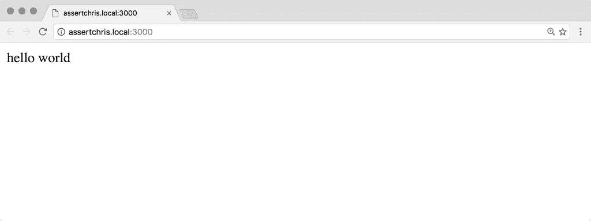
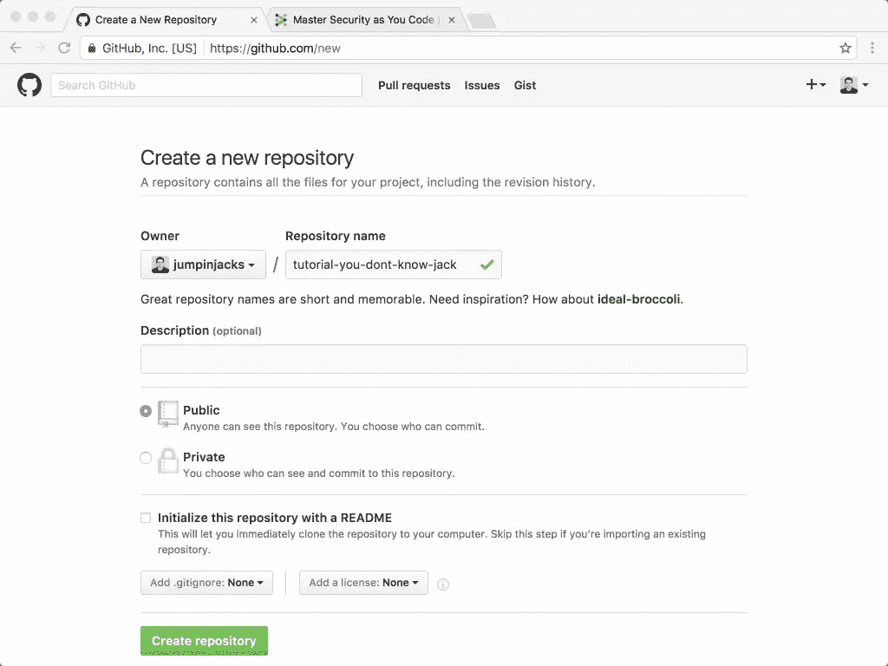
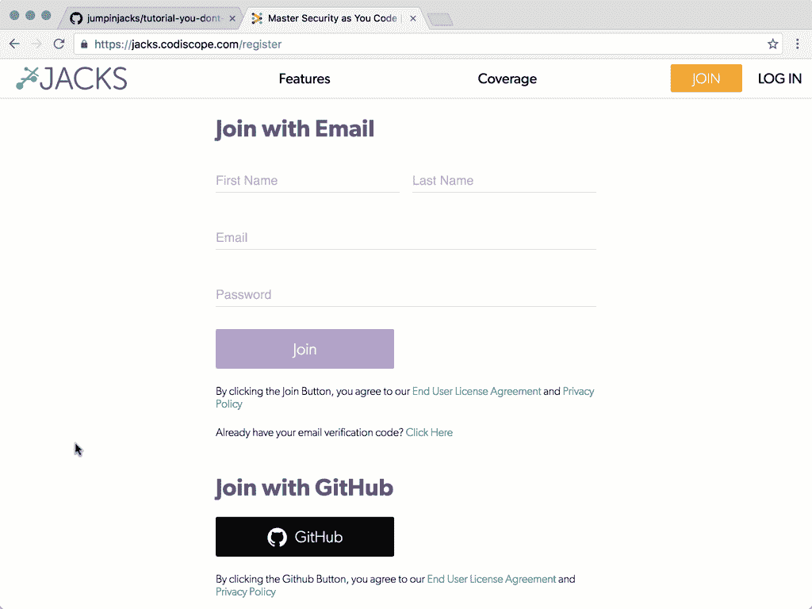
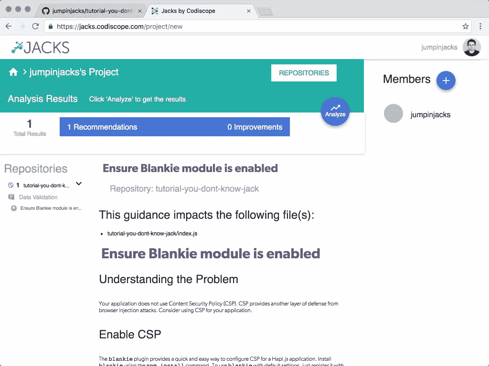
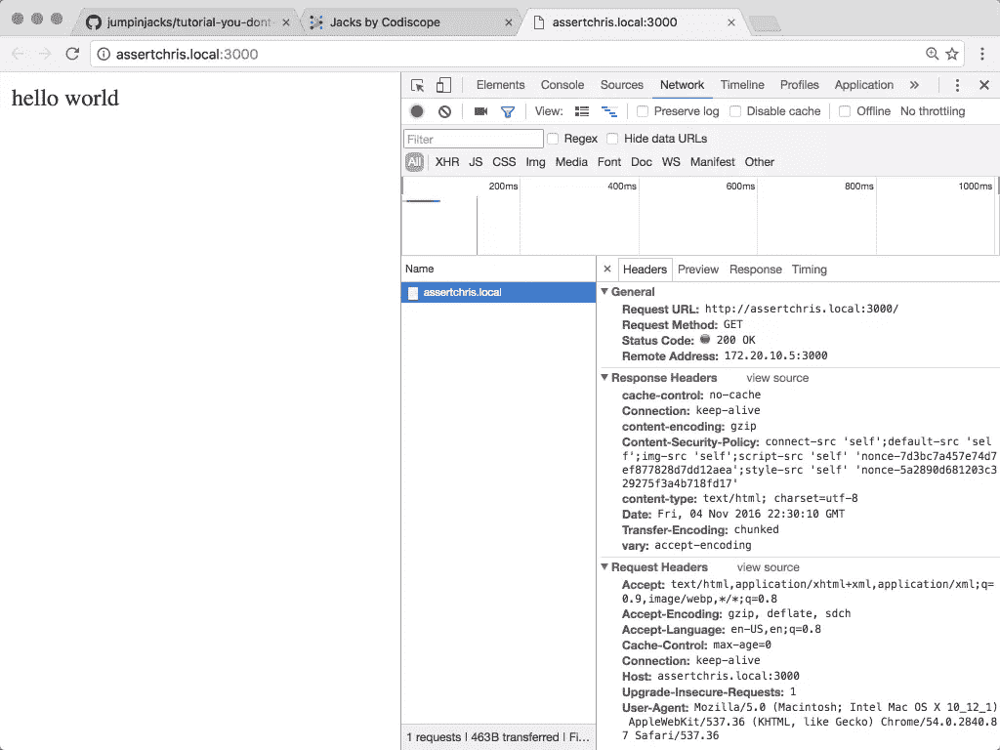
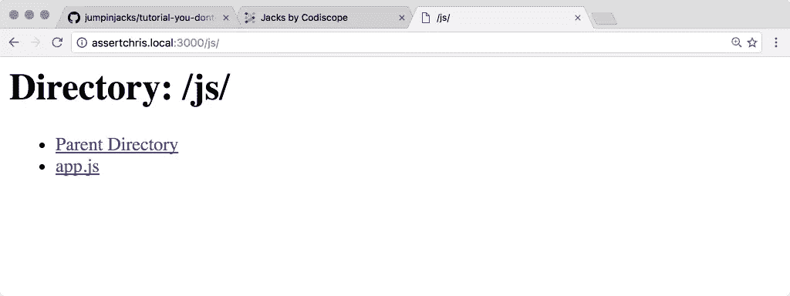
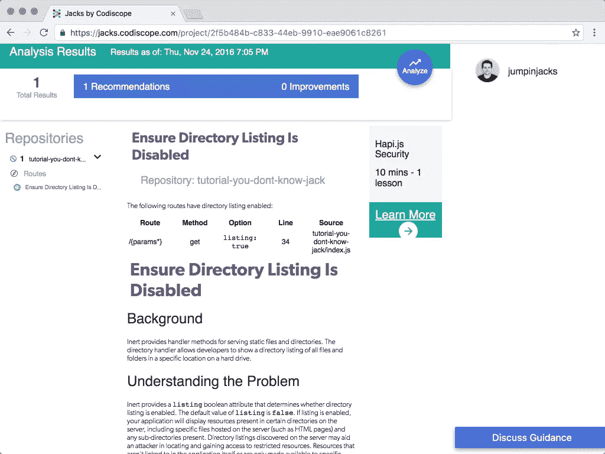
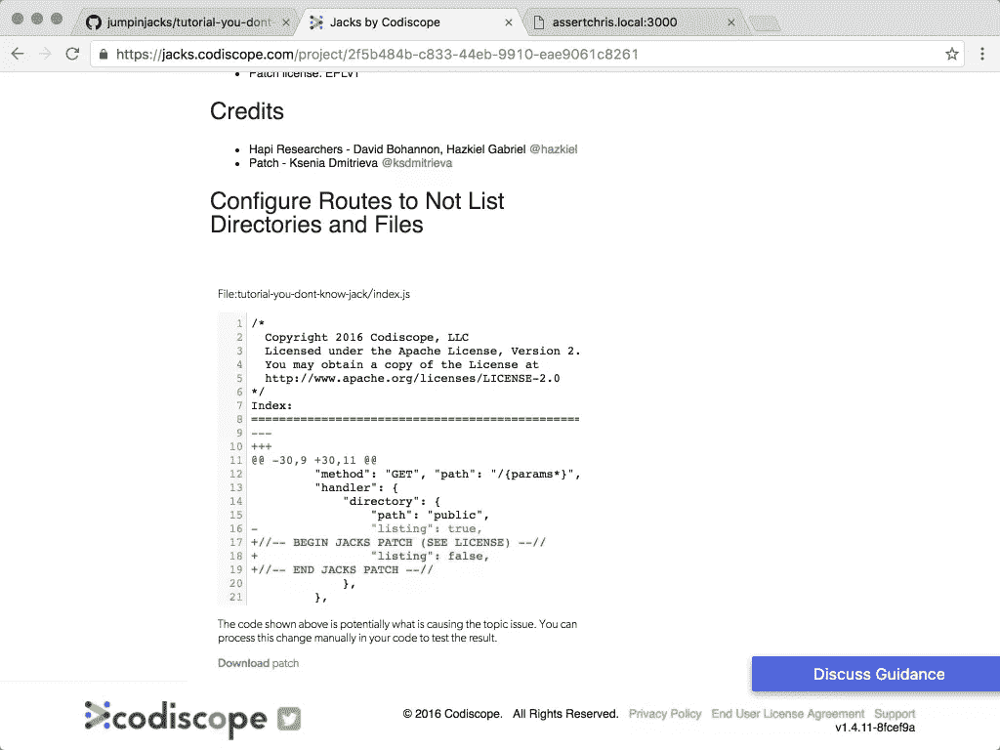

# 你不知道杰克:学会让你的代码更安全

> 原文：<https://www.sitepoint.com/you-dont-know-jacks/>

本文由 [Codiscope](https://www.codiscope.com/) 赞助。感谢您对使 SitePoint 成为可能的赞助商的支持。

我以前玩过一个游戏叫[你不认识杰克](http://jackboxgames.com/project/ydkj-classic-bundle/)。这是一个琐事游戏，设定为游戏节目，在其中输了很有趣。在给出错误答案后，玩家会受到游戏主持人的[机智而无礼的斥责](https://www.youtube.com/watch?v=5zI3iNOjCrY)。

这也是一个可悲的教训，说明小细节意味着做对事情和做错事情之间的差别。

最近有人让我写关于 [Jacks](https://jacks.codiscope.com/) 的文章。我以前从未听说过它，但它立刻引起了我的兴趣。你看，当你学习如何安全地编码时，没有多少服务声称能帮助你。杰克想成为那种服务。几乎像一个教练。从不睡觉。而且不花一分钱。

与琐事游戏不同，它更加宽容。当你真的不知道自己在做什么的时候，这是很棒的——当我决定学习一个新的 web 框架时，我发现了这一点。

> 这篇文章的大部分代码可以在 [Github](https://github.com/jumpinjacks/tutorial-you-dont-know-jack.git) 上找到。我已经在 macOS Sierra 的 Node `7.0.0`上测试过了。

## 得到哈比神

我已经编写了许多小的 NodeJS 应用程序，并且我经常发现 [Express](http://expressjs.com/) 刚好满足我的 web 应用程序需求。但是我也想知道如何最好地构建一个更大的应用程序。有固执己见的选择，像[阿多尼斯](http://adonisjs.com/)，但我已经很熟悉了。在踢杰克的轮胎的同时，我能学到什么新东西？

然后我在[杰克的主页](https://jacks.codiscope.com/)上看到了[哈比神](http://hapijs.com/)的名字。

我打开终端，创建了一个新的项目文件夹，安装了哈比神:

```
yarn add hapi 
```

> 你也可以使用 [NPM](https://www.npmjs.com/package/hapi) 安装哈比神。我只是一个趋势的吸盘，和[纱](https://github.com/yarnpkg/yarn)是相当织补快！

根据文档，制作哈比神应用程序非常简单:

```
"use strict"

const hapi = require("hapi")

const server = new hapi.Server()

server.connection({
    "port": 3000,
})

server.route({
    "method": "get", "path": "/",
    handler: function (request, reply) {
        reply("hello world")
    },
})

server.start(err => {
    if (err) {
        throw err
    }

    console.log("server at " + server.info.uri)
}) 
```

*这是来自`index.js`。*

如果您使用过 Express，您应该对它有些熟悉。我创建了一个新的 HTTP 服务器，只有一条路由。当浏览器请求`/`时，该路由将回复`hello world`:



## 插入电源

下一步是将我的 Github 帐户连接到 Jacks。创建一个 Jacks 帐户相当容易，而且是免费的。首先，我建立了一个新项目:



…然后我将我的 Github 帐户(和项目资源库)连接到 Jacks:



这一切从开始到结束大约花了 2 分钟。

## 犯错误

现在是时候看看杰克斯到底有多有用了。我收集了一份常见的 web 应用程序安全错误列表，并决定尝试几个，看看 Jacks 会怎么说(以及它如何教会我更好地工作)。

### 内容安全政策

在这一点上，我不指望杰克有任何推荐给我。但是，当我回到界面时，我看到了它给我的第一点建议:



我花了一些时间寻找一个好的解释，但我最终在[内容安全政策 CSP 参考&示例](https://content-security-policy.com/)找到了一个。CSP 本质上是一种限制 HTTP 资源加载位置的方法。这很好，因为恶意用户可能已经能够注入自定义脚本和/或图像，将无法轻易利用这些漏洞。

Jacks 还提供了如何将 [Blankie](https://github.com/nlf/blankie) 添加到我的服务器脚本的示例代码:

```
"use strict"

const hapi = require("hapi")
const blankie = require("blankie")
const scooter = require("scooter")

const server = new hapi.Server()

// ...create server + connection + routes

server.register([scooter, {
    "register": blankie,
    "options": {
        // ..CSP directives here
        "defaultSrc": "self",
    }
}], err => {
    // ...start server
}) 
```

*这是来自`index.js`。*

我需要安装布兰奇和[踏板车](https://github.com/hapijs/scooter)，以及`yarn add blankie`和`yarn add scooter`，这样代码才能运行。这些将 CSP 报头添加到每个请求:



果然，当我将代码提交到项目中时，Jacks 注意到了这一点，并将该建议标记为已解决。

### 禁用目录列表

一个常见的安全隐患是在 web 应用程序中启用(或者不恰当地禁用)目录列表。有一个流行的哈比神插件，叫做惰性，它支持静态文件服务和目录列表。启用这些功能并不罕见，所以我尝试这样做:

```
"use strict"

const hapi = require("hapi")
const blankie = require("blankie")
const scooter = require("scooter")
const inert = require("inert")

// ...create server + connection

server.register([inert, scooter, {
    "register": blankie,
    "options": {
        // ..CSP directives here
        "defaultSrc": "self",
    }
}], err => {
    // ...create other routes

    server.route({
        "method": "GET", "path": "/{params*}",
        "handler": {
            "directory": {
                "path": "public",
                "listing": true,
            },
        },
    })

    // ...start server
}) 
```

*这是来自`index.js`。*

我需要用`yarn add inert`安装惰性，这样代码才能工作。一旦我这么做了，我就能在 y web app 上看到目录列表:



我将这些代码提交给存储库，然后交给 Jacks 进行分析。不出所料，它警告不要启用目录列表:



此外，它还为我提供了补丁信息，以禁用目录列表:



这对于像我这样的哈比神初学者来说非常好。一旦我遵循了这个建议，Jacks 就不再警告我这个问题了。

### 不安全的饼干

我想测试的最后一个安全漏洞是不安全的会话/状态管理。哈比神文档展示了如何创建 cookies 来存储会话状态。他们提到了您可以使用的各种设置，以及它们的默认值。他们没有提到的是如何使用错误的设置来修补会话安全性:

```
"use strict"

const hapi = require("hapi")
const blankie = require("blankie")
const scooter = require("scooter")
const inert = require("inert")

// ...create server + connection

server.register([inert, scooter, {
    "register": blankie,
    "options": {
        // ..CSP directives here
        "defaultSrc": "self",
    }
}], err => {
    server.state("session", {
        "ttl": 24 * 60 * 60 * 1000,
        "isSecure": false,
        "isHttpOnly": false,
        "path": "/",
        "encoding": "base64json",
    })

    server.route({
        "method": "get", "path": "/",
        handler: function (request, reply) {
            let session = request.state.session

            if (!session) {
                session = {
                    "returning": true
                }
            }

            session.date = Date.now()

            return reply("hello world")
                .state("session", session)
        },
    })

    // ...create other routes
    // ...start server
}) 
```

*这是来自`index.js`。*

在这一点上，我希望 Jacks 指出那些令人不快的代码:

```
"isSecure": false,
"isHttpOnly": false, 
```

这些在我看来不太安全，而且它们也偏离了哈比神的默认值。我想这表明，尽管人类代码评估可能会揭示明显的错误，但让算法发现它们要困难得多。

## 杰克保护的其他东西

我联系了 Jacks 的开发者，他们告诉了我许多 Jacks 推荐的其他东西:

*   使用自适应单向散列函数存储密码
*   使用除 HTTP 基本身份验证之外的方法(通过 HTTPS)
*   通过 [PBKDF2](https://nodejs.org/api/crypto.html#crypto_crypto_pbkdf2_password_salt_iterations_keylen_digest_callback) 和 [Scrypt](https://github.com/barrysteyn/node-scrypt) 使用适当的工作因子
*   正确使用 CSPRNG
*   启用 CORS 白名单
*   避免 JSONP Rosetta Flash 漏洞

…这些只是针对哈比神的一些建议。Jacks 还可以分析 [MongoDB](https://www.mongodb.com/community) 并表达代码。最近他们还增加了 Java 支持，从 [Spring](https://projects.spring.io/spring-framework/) 和 [Struts](https://struts.apache.org/) 开始。

## 结论

随着我对哈比神的了解越来越多，我肯定会继续使用 Jacks。这正是我编码时需要的帮助。当我遇到困难时，我可以随时使用即时支持消息功能与他们的开发人员联系。最棒的是，它是免费的。

## 分享这篇文章