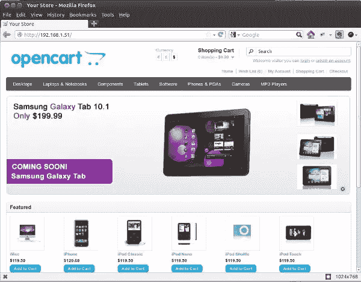
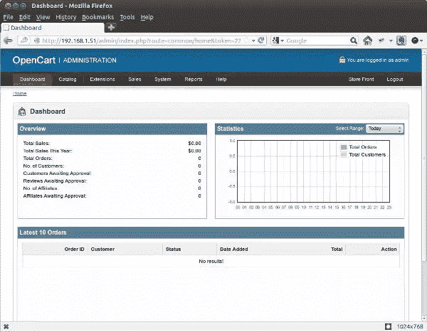
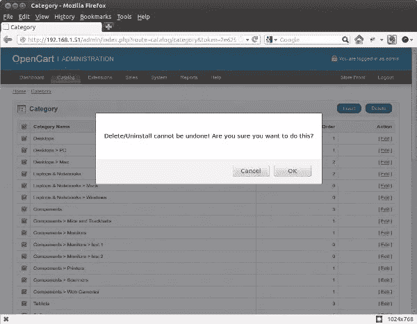
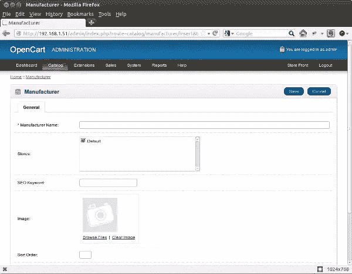

# 使用 OpenCart 的第一个电子商务商店，第 1 部分

> 原文：<https://www.sitepoint.com/your-first-ecommerce-store-with-opencart-1/>

有了这么多开源电子商务平台，创建一个网上商店就像 A、B、C 一样简单。在不到五分钟的时间里，你可以像亚马逊一样创建自己的网上店面，提供实体和数字产品进行销售。

OpenCart 是一个面向互联网商家的强大的电子商务解决方案，使他们能够以最低的成本创建自己的在线存在并参与电子商务。

在这个由两部分组成的系列中，我将解释使用 OpenCart 创建您自己的电子商务站点的所有必要步骤。在本文中，我将从它的安装开始。

## OpenCart 功能

OpenCart 是一个强大的开源购物车系统，功能丰富且用户友好。值得一试的一些特性包括:

**开源**
Open cart 最棒的一点就是可以免费下载使用。你没有必要担心使用它的许可费用。如果你修改了 OpenCart 的源代码，你可以与 OpenCart 开发者分享，这样整个社区也可以从中受益。

无限的类别/产品/制造商
在网上商店里，你需要拥有无限的类别、产品和制造商。在 OpenCart 中，您可以为您的产品创建无限数量的类别，向您的商店添加无限数量的产品，以及添加无限数量的制造商。

顾客购物/结账
有时候你想在网上商店订购商品，但又不想在购买任何商品之前注册。OpenCart 允许客人购物和结账，这使客户能够将商品添加到他们的购物车，支付商品并结账，而无需他们注册。

要了解更多关于 OpenCart 的信息，请务必访问他们的网站:opencart.com。

## 安装 OpenCart

要安装 OpenCart，首先需要[访问 GitHub](https://github.com/opencart/opencart "opencart/opencart - GitHub") 并下载最新版本的软件。OpenCart 以 ZIP 存档的形式出现，因此之后您必须将存档的内容提取到您选择的文件夹中。

解压后，您会看到一个名为 upload 的文件夹和三个名为`install.txt`、`license.txt`和`upgrade.txt`的文本文件。

`install.txt`文件包含安装说明，`license.txt`包含发布 OpenCart 的 GNU 通用公共许可证，`upgrade.txt`包含将早期版本的 OpenCart 升级到最新版本的说明，如果你已经在使用它的话。`upload`目录包含您需要上传到网络主机的文件。

将在`upload`文件夹中找到的所有文件和文件夹复制到您的 web 主机的公共目录中。根据您的主机和配置，公共目录的名称可能会有所不同，但通常它被命名为类似于`public_html`的名称。

复制文件后，您需要确保以下文件和目录是可写的:

`image/
image/cache/
image/data/
system/cache/
system/logs/
download/
config.php
admin/config.php`

要使它们可写，请确保文件的权限为 666 (rw-rw-rw)，目录权限为 777 (rwxrwxrwx)。如果您有 shell 访问权限，可以使用`chmod`命令来完成，或者通过您的主机的 cPanel 安装来轻松完成。

要在 cPanel 中做到这一点，你需要做的就是转到你上传 OpenCart 文件的目录，右击每个文件和文件夹，选择弹出框中的“更改权限”。

现在创建一个 MySQL 数据库，并为其添加一个新用户。

要创建 MySQL 数据库，您需要登录到您的数据库后端。如果它是一个 shell，那么您可以使用`CREATE DATABASE`命令并使用`GRANT`创建一个具有适当访问权限的用户。

如果您使用 phpMyAdmin，在 Create New Database 下输入您想要创建的数据库的名称，然后单击 Create 按钮。然后，要将新用户附加到新创建的数据库，请单击顶部的 Privileges 选项卡，然后单击 Add New User 按钮。输入用户名、主机(很可能是“本地”)和您选择的密码两次。在数据库下，为用户选择 None 选项。在“全局权限”下，单击“全部选中”链接。

完成所有这些操作后，您应该在浏览器中打开店面以开始安装向导。确切的 URL 将取决于您上传文件的位置；例如，如果你已经将文件上传到 public_html，那么你将打开你的域名，像*www.example.com*。如果你已经创建了`public_files/store`并上传了文件，那么你将打开*www.example.com/store*。

访问上传 OpenCart 文件的 URL 后，您将看到第一步，即“第一步-许可”。你需要做的就是勾选“我同意许可”来接受 GNU 通用公共许可，然后点击继续按钮。

下一步是“第 2 步-预安装”。预安装屏幕显示所有的安装要求、PHP 设置和扩展。它还会检查是否为文件和目录设置了正确的权限。如果没有错误，您可以单击继续按钮。

下一步是“步骤 3–配置”。您可以在这里输入数据库主机、之前创建的 MySQL 用户的用户名和密码以及数据库名称。

接下来的三个选项，用户名、密码和电子邮件，是针对管理员帐户的。您可以在这里输入用户名、密码和电子邮件地址，用于登录管理后端。

“第 3 步配置”屏幕截图如下所示。

点击继续按钮后，您将看到最后一步，“第 4 步-完成”。看到这里意味着你已经成功安装了 OpenCart。

向导完成后，您应该从服务器上删除`install`目录。这是最后一个向导屏幕中显示的“安装目录”。

OpenCart 在安装过程中安装一个样例商店，样例店面看起来是这样的:

但是在这篇文章中，我将删除所有的产品、类别和属性，并重新做所有的事情，以便您可以看到它们是如何创建的。

## 配置您的商店

拥有自己的网上商店的乐趣之一是能够添加自己的产品并设定价格。要做到这一切，首先你需要登录到管理后端，并设置一些类别来保持事情有组织。

要访问管理后端，请前往*www.example.com/admin*。使用您提供给安装向导的用户名和密码登录，您将进入管理控制面板。

管理面板显示了许多关于商店的有用信息。概览窗格显示您的总销售额、订单、客户数量等的摘要。统计窗格显示您的订单和客户的图表。“最近 10 个订单”窗格显示了您的商店中最近的 10 个订单。

让我们删除现有的类别、产品和属性，以便您可以开始设置自己的库存。第一个要删除的数据是现有的类别。

要删除所有类别，请从顶部菜单中选择目录>类别。将显示所有已定义类别的列表。

勾选列表左上角类别名称标签旁边的复选框，一次性选择所有类别，然后单击左上角的删除按钮删除它们。将显示一个确认框来确认该操作。

然后，对产品列表(目录>产品)、属性列表(目录>属性>属性)、属性组(目录>属性>属性组)和制造商列表(目录>制造商)重复该过程。

现在是时候开始将您自己的数据添加到 OpenCart 中了！

## 创建您自己的类别

类别是相关产品的分类。例如，IPhone 5、黑莓 9800 和三星 S2 都可以归类为智能手机。在 OpenCart 中，您可以创建无限数量的类别和子类别，以您认为合适的方式组织您的产品。

要创建自己的类别，请导航至目录>类别。单击类别页面上的插入按钮，您将看到以下表单:

页面上有三个不同的选项卡可供您使用。

在 General 选项卡下，您可以输入关于类别的基本信息，例如类别的名称、meta 标签描述、关键字和描述。

在 Data 选项卡下，您可以选择父类别(用于创建包含子类别的层次结构)、商店(如果您使用相同的 OpenCart 安装运行多个商店)、SEO 关键字、类别图像、是否在顶部菜单栏中显示类别、列数、排序顺序以及类别是否启用。

“设计”选项卡下是选择设计布局的选项。我现在不讨论这个；你可以暂时把它留为空白。

在继续之前，尝试输入几个您自己的类别。

## 创建自己的制造商

制造商是你的产品的制造者和生产者。例如苹果、惠普、耐克都是制造商的例子。添加新的制造商就像点击“目录”>“制造商”,然后点击“制造商”页面的“插入”按钮一样简单。

制造商表单为您提供了一个输入制造商名称、适用的商店、SEO 关键字、徽标图像和排序顺序的地方。

试着输入一些制造商。

## 摘要

我将在这里结束本教程的第一部分。到目前为止，您已经学习了如何安装 OpenCart、登录管理部分以及创建类别和制造商。

在本系列的下一篇文章中，我将深入探讨 OpenCart，并讨论添加选项、属性、属性组，以及最重要的产品！敬请关注。

图片 via[Fotolia](http://us.fotolia.com/?utm_source=sitepoint&utm_medium=website_link&utm=campaign=sitepoint "Royalty Free Stock Photos at Fotolia.com")

## 分享这篇文章