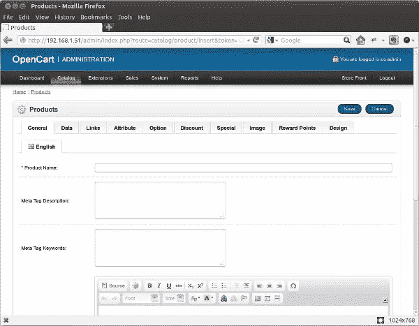

# 使用 OpenCart 的第一个电子商务商店，第 2 部分

> 原文：<https://www.sitepoint.com/your-first-ecommerce-store-with-opencart-2/>

在本系列的第一部分中，我谈到了如何安装 OpenCart。我还谈到了第一次建立 OpenCart 商店时需要的一些基本配置，以及如何创建新的产品和制造商类别。

在这一部分中，我将深入探讨 OpenCart，讨论添加选项、属性、属性组，最重要的是添加类别和产品。请享用。

## 创建选项

订购产品时，在选定产品后，通常会给你机会指定你想要的颜色和尺寸。这些正是选项——您在结账前为个性化产品所做的选择。OpenCart 使您能够将不同的选项与产品相关联。

要设置选项，请转到“目录”选项卡，并从下拉框中选择“选项”。要创建选项，您必须输入选项的名称、类型(如选择列表、单选选项、复选框等。)，以及排序顺序。当您有多个选项与一个产品相关联时，排序顺序允许您更改选项显示的顺序。

## 创建属性和属性组

属性是可以用来比较产品之间的相似性和差异性的特性。一个完美的例子是当你试图比较两部 IPhone 的重量、颜色和存储空间时，比如 IPhone 4 和 IPhone 4S。

要创建属性，请转到目录>属性>属性，然后单击插入。您需要提供属性的名称、组和排序顺序。

属性组只是相关属性集合的名称。黑色、红色和黄色等属性都可以归入属性组“颜色”下。

要创建属性组，请转到目录>属性>属性组，然后单击插入。

## 添加产品

现在是建立你的 OpenCart 商店的最重要的部分…添加产品！IPhone 5，苹果 MacBook Pro，polo shrits 等。都是产品的例子；产品是你商店的主要部分。

要创建产品，请转到目录>产品，然后单击插入。你将看到十个选项卡，其中最重要的是:常规、数据、链接、属性、选项、折扣和图像。您必须掌握产品的详细信息，这样您的客户才能了解他们购买的产品。

在“常规”选项卡下，您可以输入产品的基本信息，如名称、元标签描述、关键字和描述。

在“数据”选项卡下，您可以指定产品的型号、SKU(库存单位)、UPC(通用产品代码)、价格、最低购买量、库存状态、尺寸和重量信息等。

“链接”标签包含设置制造商、类别和相关产品的字段。

“属性”选项卡允许您设置产品的各种可用属性，“选项”选项卡允许您设置产品的各种可用选项。

“折扣”标签允许您设置客户购买产品时可能提供的任何折扣定价信息。

“图像”选项卡允许您上传产品的各种图像，以便客户了解产品的外观。

设置完所有这些信息后，单击保存按钮保存产品。

“产品”屏幕截图如下所示。继续尝试输入一些您自己的产品。

要在以后编辑任何产品的属性，请转到目录>产品，然后单击所需产品的操作列下的编辑链接。

## 摘要

这就把我们带到了“使用 OpenCart 创建您的第一个电子商务商店”系列的结尾。现在你知道如何安装 OpenCart，创建类别和其他属性和分组来保持你的商店井然有序，最重要的是如何添加产品。

我希望你喜欢这个系列，并祝你拥有自己的 OpenCart 电子商务商店！

<small>图片 via[Fotolia](http://us.fotolia.com/?utm_source=sitepoint&utm_medium=website_link&utm=campaign=sitepoint "Royalty Free Stock Photos at Fotolia.com")</small>

## 分享这篇文章