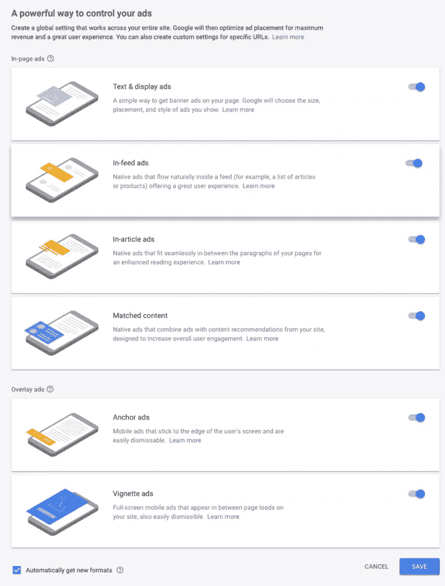
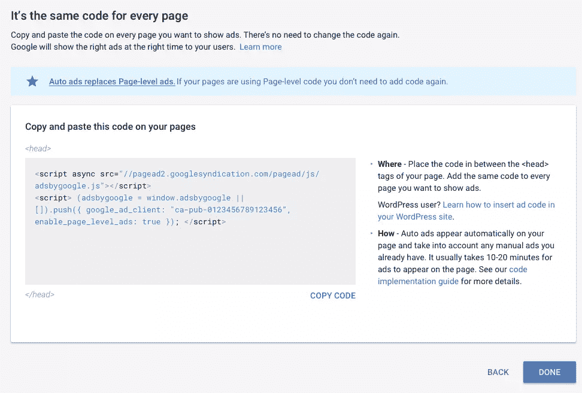
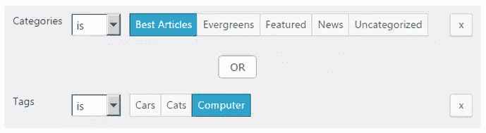

# 你的网站可以通过谷歌的汽车广告赚取更多

> 原文：<https://www.sitepoint.com/your-website-can-earn-more-with-googles-auto-ads/>

*本文是与 [Google AdSense](https://www.google.com/adsense/start/?utm_source=Sitepoint.com&utm_medium=partnerships&utm_campaign=SitePointPartnerAdContent) 合作创作的。感谢您对使 SitePoint 成为可能的合作伙伴的支持。*

有效的网站建立业务。他们提升你的形象，加强你的品牌，并带来新的客户。他们也可以自己赚钱，最简单的入门方式就是点击付费广告。

如果听起来工作量很大，其实不必如此。它也不一定要把你的网站变成一个浮华的广告牌。一旦建立，你的网站将继续产生额外的收入——甚至在你睡觉的时候。

你开始得越早，积累得就越快。所以让我们开始吧。

## 为什么是 AdSense？

Google AdSense 是将你的内容货币化的简单方法。经过一个简单的设置过程，你就可以进入世界上最大的在线广告商网络，无论访问者是否转化为销售，你都可以从每次点击中获得报酬。

> “让我们在您专注于发展业务的同时增加您的收入。”([站长团队](https://www.google.com/adsense/start/?utm_source=Sitepoint.com&utm_medium=partnerships&utm_campaign=SitePointPartnerAdContent))

因为广告是相关的和不唐突的，你对你的访问者保持信任。谷歌专注于良好的用户体验，而不是混淆或误导用户。当你赢了，他们也赢了。

> AdSense 广告最好的一点是，它们遵循谷歌关于用户体验的所有规则，这意味着它们往往比其他横幅广告和展示广告更不显眼，更不浮华，更有针对性——它们的上下文是一大优势，因为相关性是这里的主要游戏——广告越相关，你越有可能获得报酬。( [Adsense 和 AdWords——为什么要使用它们？](https://www.sitepoint.com/adsense-and-adwords-why-use-them/))

你会赚多少？这很难说，取决于你的网站内容的质量和独特性，你获得的流量，甚至流量的类型。所以继续做你的网站和内容。

严重的金钱可能需要数以千计的游客一天。但是你不需要等到那个时候——把它看作是一项正在进行的工作。现在就开始，边学边做，并随着时间的推移跟踪你的进步。

## 为什么是汽车广告？

[汽车广告](https://adsense.googleblog.com/2018/02/introducing-adsense-auto-ads.html)通过使用机器学习使 AdSense 更容易设置。Google intelligence 会为你做这些工作，选择表现良好的广告，并把它们放在能产生最大效果的地方。

这是一个游戏规则的改变者，允许你以一种简单的方式在你的网站上添加广告，并从中获得增量收入，而不需要花费额外的时间和精力。这确实需要将控制权交给谷歌，谷歌使用页面抓取技术来分析和理解每个页面，以便人工智能能够适应并改善广告表现。

这很有效。在测试期间，参与的出版商通过使用汽车广告获得的收入比他们自己获得的收入平均多 10%。

首先，你只需要在你想放广告的每个页面上添加一个代码片段。之后，您可以通过切换来选择显示哪些广告格式，从而调整 AdSense 帐户中的设置，而无需编辑代码。

此外，确保你利用了[广告尺寸优化](https://support.google.com/adsense/answer/9139818)，这是谷歌在 2019 年添加的一项功能。它会自动优化移动设备上的固定尺寸广告，考虑访问者设备的屏幕尺寸和方向。

## 设置您的帐户

在您的网站上使用 AdSense 之前，您需要完成一个申请流程。很简单，免费，只需要一两分钟。批准可能需要几天时间。

前往[www.google.com/adsense](https://www.google.com/adsense/start/?utm_source=Sitepoint.com&utm_medium=partnerships&utm_campaign=SitePointPartnerAdContent)，点击“立即注册”按钮。你只需要提供你的网站的网址和你的电子邮件地址。你可以选择加入或不加入 AdSense 电子邮件。大概就是这样。简单。

## 在你的网站上设置汽车广告

现在你有了一个新的 AdSense 帐户，下面是如何在你的网站上安装和运行自动广告。

**选择广告类型**

登录[你的账户](https://www.google.com/adsense/start/?utm_source=Sitepoint.com&utm_medium=partnerships&utm_campaign=SitePointPartnerAdContent)，导航到*我的广告*，然后*开始*。选择您想要显示的广告格式，然后点击*保存*。以后可以随时调整自己的选择。

**插入代码**

在下一页，你会看到一个代码片段。对于静态站点，复制它，然后粘贴到每个页面的`<head>`和`</head>`标签之间。广告可能需要 10-20 分钟才会出现。

在 WordPress 上最好不要直接编辑你的主题代码，否则你的修改会在每次主题更新时被覆盖。相反，使用一个插件让你的网站与自动广告一起工作。有很多可用的，包括谷歌认可的三个:

*   [插入页眉和页脚](https://wordpress.org/plugins/insert-headers-and-footers/)，自由
*   [高级广告](https://wpadvancedads.com/adsense-auto-ads-wordpress/)，免费
*   [Ad Inserter Pro](https://adinserter.pro/documentation/adsense-ads) ，20 欧元起

一旦你安装并启用了你的插件，你将不得不配置它与 AdSense 和 Auto ads 一起工作。取决于你选择了哪一个，这可能包括添加你的 AdSense 发布者 ID 和在设置中启用自动广告，你就可以开始了。

**手机优化**

如果你在你的网站上使用了很多固定尺寸的广告单元，你会希望谷歌也能优化手机上的广告尺寸。登录[站长](https://www.google.com/adsense/start/?utm_source=Sitepoint.com&utm_medium=partnerships&utm_campaign=SitePointPartnerAdContent)，导航到*优化*，然后是*机会*页面。在“优化设置”部分查找*广告大小*设置，选择“100%优化移动页面浏览量”。

**改变整个网站的广告设置**

现在，手动和自动广告一直显示在你网站的每一页上。您可以选择保持原样，或者您可能更喜欢调整某些页面上的广告设置:

*   如果你只展示文章内广告，长文章可能看起来更好。
*   你可以决定在某些页面上覆盖一个锚或插图广告。
*   在其他页面上，你可以选择不显示任何广告。

有几种方法可以实现这一点。对于汽车广告，谷歌允许你创建 [URL 组](https://support.google.com/adsense/answer/7627395?hl=en),这些 URL 组可以覆盖你的全局广告设置，为特定的页面设置定制。可以使用域、子域、目录或页面作为标准来创建组。

虽然这很有用，但按 URL 对页面进行分组并不总是最好的方式。WordPress 插件通过允许你使用额外的标准来提供更多的能力和灵活性。例如，Advanced Ads 允许您按类别、标签、分类、作者和年龄对帖子进行分组，Ad Inserter Pro 可以使用类别、标签、分类、帖子类型、帖子 ID 和 URL。

## 开始吧！

如果你有一段时间一直在考虑将你的网站货币化，我希望这篇文章能促使你采取行动。开始吧，继续增加和改进你的网站内容，努力增加流量。谷歌可以通过自动匹配你的内容来保持广告的相关性，你的访客越多，点击量也就越大。

越早开始，你就能越早开始赚钱，而且开始并不难。注册 Google AdWords 快速而轻松，自动广告使设置变得简单，广告尺寸优化使您的广告只需点击一下开关即可响应。

前往 https://www.google.com/adsense 报名。

## 分享这篇文章