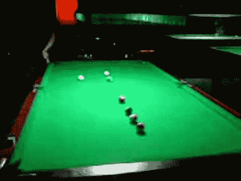
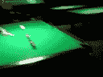
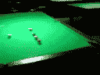
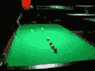

# Youtube 视频缩略图 URL

> 原文：<https://www.sitepoint.com/youtube-video-thumbnail-urls/>

YouTube 的文档很混乱，所以这里有一个快速参考，告诉你如何做以及它的含义。这篇文章是之前一篇关于如何使用 jQuery 显示 YouTube 视频缩略图的文章的继续。

列表中的第一个是全尺寸图像，其他是缩略图。

```
https://img.youtube.com/vi/dXo0LextZTU/0.jpg
https://img.youtube.com/vi/dXo0LextZTU/1.jpg
https://img.youtube.com/vi/dXo0LextZTU/2.jpg
https://img.youtube.com/vi/dXo0LextZTU/3.jpg
```

https://img . YouTube . com/VI/dxo 0 Lexus ku/0 . jpg


https://img . YouTube . com/VI/dxo 0 Lexus ku/1 . jpg


https://img . YouTube . com/VI/dxo 0 Lexus ku/2 . jpg


https://img . YouTube . com/VI/dxo 0 Lexus ku/3 . jpg


还有高质量，中等质量和标准清晰度版本的缩略图。

```
https://img.youtube.com/vi/dXo0LextZTU/default.jpg
https://img.youtube.com/vi/dXo0LextZTU/hqdefault.jpg
https://img.youtube.com/vi/dXo0LextZTU/mqdefault.jpg
https://img.youtube.com/vi/dXo0LextZTU/sddefault.jpg
```

https://img . YouTube . com/VI/dxo 0 Lexus ku/default . jpg


https://img . YouTube . com/VI/dxo 0 lexetu/hqdefault . jpg
t1]

https://img . YouTube . com/VI/dxo 0 Lexus ku/mqdefault . jpg
t1]

https://img . YouTube . com/VI/dxo 0 lexetu/sdefault . jpg
t1]

 <h3valid key="" values="" are="" h3="">* **默认**–默认缩略图。视频或引用视频的资源(如播放列表项或搜索结果)的默认缩略图是 120 像素宽和 90 像素高。频道的默认缩略图宽 88px，高 88px。
* **中等**–缩略图的更高分辨率版本。对于视频(或引用视频的资源)，此图像宽 320 像素，高 180 像素。对于一个通道，这个图像宽 240 像素，高 240 像素。
* **高**–缩略图的高分辨率版本。对于视频(或引用视频的资源)，此图像宽 480 像素，高 360 像素。对于一个通道，这个图像宽 800 像素，高 800 像素。

### 更多信息

使用此服务不需要 API 密钥。

所有上述网址也可以通过 https 访问。只需将上述任意一个网址中的 http 改为 https 即可。此外，在上面的示例 URL 中，稍微短一点的主机名 i3.ytimg.com 代替了 img.youtube.com。

### 代码示例

JS—[https://code . Google . com/p/YouTube-API-samples/source/browse/# git % 2f samples % 2f JavaScript](https://code.google.com/p/youtube-api-samples/source/browse/#git%2Fsamples%2Fjavascript)
PHP—[https://code . Google . com/p/YouTube-API-samples/source/browse/samples/PHP/upload _ thumbnail . PHP](https://code.google.com/p/youtube-api-samples/source/browse/samples/php/upload_thumbnail.php)

### 来源

https://developers . Google . com/YouTube/v3/docs/videos # snippet . thumbnails . % 28 key % 29
[http://stack overflow . com/questions/2068344/how-to-get-thumbnail-of-YouTube-video-link-using-YouTube-API](http://stackoverflow.com/questions/2068344/how-to-get-thumbnail-of-youtube-video-link-using-youtube-api)</h3valid> 

## 分享这篇文章