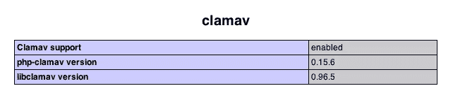

# ClamAV 作为 Zend 框架中的验证过滤器

> 原文：<https://www.sitepoint.com/zf-clamav/>

好了，你对使用 Zend 框架已经相当熟悉了，特别是表单的使用。除此之外，您还很好地掌握了如何组合大量的[标准验证器](http://framework.zend.com/manual/en/zend.validate.html)，如*信用卡*、*电子邮件地址*、 *Db_RecordExists* 和*十六进制*，以及[标准过滤器](http://framework.zend.com/manual/en/zend.filter.html)，如*压缩/解压缩*、*基本名称*、*加密*和*真实路径*但是，当出现预打包的验证器和过滤器范围之外的情况时，该怎么办呢？

比方说，你想防止用户上传含有病毒的文件。您必须编写一个自定义的验证程序来检查上传的内容是否被感染。今天我将向您展示如何做到这一点——如何为 Zend Framework 编写一个新的文件验证过滤器，它使用 [ClamAV](http://www.clamav.net/lang/en/) 来确保上传的文件是无病毒的。

## 向 PHP 添加 ClamAV 支持

首先你需要安装 ClamAV 支持。我是基于 Linux，特别是 Ubuntu 的安装过程。如果您正在使用另一个发行版，您可能需要相应地调整命令。不幸的是，如果你使用的是 Windows，你需要使用一个基于 Linux 的虚拟设备或者安装一个运行 Linux 的虚拟机，因为 php-clamav 扩展还不支持 Windows。

在尝试安装 ClamAv 之前，请确保已经安装了库的依赖项。您还需要确保您已经安装了 PHP 开发包，以便`phpize`可用。您可以通过运行以下命令来实现这一点:

```
msetter@tango:~$ sudo apt-get install php5-dev libclamav-dev clamav libclamav6 clamav-freshclam
```

一旦安装了依赖项，从[sourceforge.net/projects/php-clamav](http://sourceforge.net/projects/php-clamav)获取 php-clamav 库的副本，并将其解压到系统上的临时目录中。导航到提取的库的目录，并运行以下命令:

```
msetter@tango:~/php-clamav$ phpize
msetter@tango:~/php-clamav$ ./configure --with-clamav
msetter@tango:~/php-clamav$ make
```

如果它们都正确执行，您将在 modules 子目录中找到一个新编译的模块。将模块复制到其余 PHP 模块所在的目录中。您的系统可能会有所不同，但我能够做到这一点:

```
msetter@tango:~/php-clamav$ sudo cp modules/clamav.so /usr/lib/php5/20090626+lfs/
```

然后，您需要在 PHP 的配置文件中启用该模块。这很简单，只需在`php.ini`中添加下面一行，然后重启 Apache:

```
extension=clamav.so
```

最后，要么从命令行运行`php -i`，要么执行一个简单的 PHP 脚本，其中只包含对`phpinfo()`的调用，以验证新的扩展是否启用。您应该会看到类似下面的输出。



ClamAv 库附带了一系列常量和函数，但在本文中，我将只关注两个函数，`cl_scanfile()`和`cl_pretcode()`，因为您需要做的只是扫描上传的文件，如果发现病毒，就报告它是什么。欲了解其他可用功能的更多信息，请访问 php-clamav.sourceforge.net。

## 构建文件上传验证器

既然已经安装并启用了扩展，让我们开始构建 Zend Framework ClamAV 文件上传验证器。我假设您已经有了一个启用了模块支持的 Zend Framework 项目，并且已经准备就绪。通过在您的`application.ini`文件中添加以下行来添加对新验证库的支持:

```
autoloaderNamespaces[] = "Common_"
```

然后，在 Zend Framework 项目根目录的库目录下，创建目录`Common/Validate/File`，并在其中创建一个名为`ClamAv.php`的文件，其内容如下:

```
<?php
class Common_Validate_File_ClamAv extends Zend_Validate_Abstract
{
}
```

这样，您的新验证器类将可用于项目。

如果你不熟悉 Zend Framework 中的验证器，它们是非常简单的事情。您可以从`Zend_Validate_Abstract`或`Zend_Validate_Interface`扩展它们。出于这个例子的目的，我将验证器建立在前者的基础上。鉴于此，您只需实现两个方法:构造函数和`isValid()`。

构造函数应该检查 ClamAv 扩展是否被加载，因为它不是 PHP 的标准发行版附带的。

`isValid()`方法将执行验证器的核心工作。通常情况下，该方法会验证一些输入，如果验证成功，则返回 true 如果验证失败，则在错误列表中设置一条错误消息，随后显示该消息，并返回 false。根据表单验证器的配置，返回 false 将会暂停表单验证，或者让剩余的验证器继续运行。

填写`Common_Validate_File_ClamAv`类，如下所示:

```
<?php
class Common_Validate_File_ClamAv extends Zend_Validate_Abstract
{
    const STATUS_CLEAN = 0;
    const NOT_READABLE = "fileNotReadable";
    const FILE_INFECTED = "fileInfected";

    protected $_messageTemplates = array(
        self::FILE_INFECTED => "File '%value%' is infected",
        self::NOT_READABLE => "File '%value%' is not readable");

    public function __construct() {
        if (!extension_loaded('clamav')) {
            throw new Zend_Validate_Exception(
                "ClamAv extension is not loaded");
        }
    }

    public function isValid($value, $file = null) {
        if ($file === null) {
            $file = array("type" => null, "name" => $value);
        }

        if (!Zend_Loader::isReadable($value)) {
            return $this->_throw($file, self::NOT_READABLE);
        }

        $retcode = cl_scanfile($value, $virusname);
        if ($retcode !== self::STATUS_CLEAN) {
            printf("File path: %s | Return code: %s | Virus found name: %s",
                $value, cl_pretcode($retcode), $virusname);
            return $this->_throw($file, self::FILE_INFECTED);
        }

        return true;
    }

    protected function _throw($file, $errorType) {
        $this->_value = $file["name"];
        $this->_error($errorType);
        return false;
    }
}
```

首先，指定一组类常量，这些常量定义了自定义错误消息的病毒检查字符串模板的返回状态。接下来，构造函数检查 ClamAv 支持是否可用。如果它不可用，那么就会抛出一个异常。

`isValid()`方法检查传入的`$value`参数是否包含文件名以及该文件是否可读。如果是，那么调用`cl_scanfile()`函数。从`cl_scanfile()`返回的代码表明文件是否无病毒。如果不是，则使用`cl_pretcode()`功能检索病毒名称并打印信息。

`_throw()`方法负责在类中设置适当的错误常数，并返回 false 表示验证失败。如果发生这种情况，链接到常量的错误消息将通过在输入元素上使用错误装饰器显示在上传表单中。

## 测试验证程序

编写完验证器后，您需要一个表单来使用它并测试它是否工作。手动或使用`zf.sh`，在默认模块的`IndexController`类中创建一个新动作，并将其命名为“fileUpload”。向其中添加以下代码:

```
<?php
class IndexController extends Zend_Controller_Action
{
...
    public function fileUploadAction() {
        $form = new Zend_Form();
        $form->setAction("/default/index/file-upload")
             ->setMethod("post");

        $uploadFile = new Zend_Form_Element_File("uploadfile");
        $uploadFile->addValidator(new Common_Validate_File_ClamAv())
           ->setRequired(true)
           ->setLabel("Upload file:");

        $form->addElement($uploadFile);
        $form->addElement(new Zend_Form_Element_Submit("submit"));

        if ($form->isValid($_POST)) {
            $values = $form->getValues();
            $this->view->messages = array("File uploaded");
        }

        $this->view->form = $form;
    }
}
```

这里您已经创建了一个简单的表单，并设置了它的动作和方法属性、一个提交按钮和一个文件元素。新创建的 ClamAv 文件验证器被添加到 file 元素中。此外，required 标志被设置为 true，以确保必须上传文件。接下来，两个元素都被添加到表单中，一个简单的 if 语句检查表单是否已经提交。

如果表单在提交后没有通过验证(即文件带有病毒)，那么将使用标准的错误消息装饰器显示一条验证消息。否则，将向视图的消息中添加一条消息，该消息将向用户显示，以表明上传成功。

最后一部分是视图脚本，如下所示:

```
<h1>Zend Framework - ClamAV File Upload Validator</h1>
<?php
if (count($this->messages)) {
    echo '<ul id="messages">';
    foreach ($this->messages as $message) {
        echo "<li>" . $this->escape($message) . "</li>";
    }
    echo "</ul>";
}
echo $this->form;
```

由于控制器和验证器已经完成了大部分工作，视图脚本不需要做太多。它只显示控制器设置的任何消息，并呈现表单。

## 摘要

完成所有这些代码后，您现在有了一个新的 Zend 框架验证器，它将通过 PHP ClamAv 库检查文件是否没有病毒。我希望这篇文章对您有所帮助，它展示了如何在 Zend 框架中创建您自己的定制验证器，并且能够确保您从现在开始在中创建的应用程序中没有病毒上传。如果您想进一步检查代码，本文的[代码可以在 GitHub 上克隆。](https://github.com/phpmasterdotcom/ZFClamAvValidationFilter)

图像通过[数学图形](http://www.shutterstock.com/gallery-577981p1.html) / [快门](http://www.shutterstock.com)

## 分享这篇文章