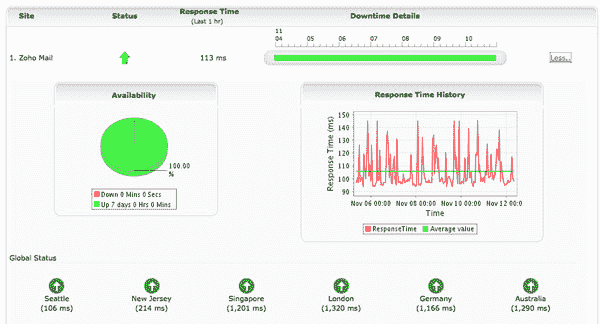

# Zoho 发布状态:应用程序透明度做得好

> 原文：<https://www.sitepoint.com/zoho-launches-status-app-transparency-done-right/>

昨天，网络办公应用提供商 [Zoho](http://www.zoho.com/) 推出了一项新服务:[状态](http://status.zoho.com/)，追踪所有 24 款 Zoho 应用的健康状况。状态页面以一种易于理解的格式呈现了 Zoho 应用健康状况的快速概览，包括可用性和响应时间。

新页面加载了 Zoho 应用程序的上线或下线状态的摘要视图，很容易判断问题是出在你这边还是他们那边。此外，每个应用程序的报告可以扩展为提供有用指标的小集合，包括过去一周的正常运行时间和响应时间，以及来自全球六个不同地点的响应时间:西雅图、新泽西、新加坡、伦敦、德国和澳大利亚。

Zoho 的状态页面由 [Site24x7](http://site24x7.com/) 提供支持，正常运行时间监控服务也由 Zoho 母公司 AdventNet Inc .所有。Site24x7 昨天发布了自己的消息，宣布发布新的企业版，为 web 应用程序提供商提供 SLA 管理。

 Y

Zoho 福音传播者 Raju Vegesna 通过电子邮件告诉我，在过去的四个月里，Zoho 一直在推出其大多数商业应用程序的付费版本，并正在扩展其第一个付费应用程序 Zoho CRM 的 SLA，以覆盖其他应用程序。新的状态页面将有助于让客户及时了解任何停机问题，并确保 Zoho 遵守其正常运行时间的保证。

“随着我们推出更多付费版本的服务，透明度变得与正常运行时间和 SLA 一样重要，”Vegesna 在一份新闻稿中说。“我们的用户有权了解 Zoho 在不同地点的长期表现。更多的企业组织同意我们的观点，这激励我们发布了 Site24x7 企业帐户。”

Zoho Status 的推出展示了令人钦佩的透明度，其他应用程序提供商应该效仿。

“这一举措是对我们的用户更加开放和透明的又一步，”Vegesna 说。我们希望其他网络应用程序能效仿 Zoho，为客户提供监控工具，让他们更容易确保自己的钱花得值。在决定是否迁移到基于 web 的应用程序时，正常运行时间是企业最关心的问题之一。这种透明度将有助于缓解大企业客户的一些担忧。

## 分享这篇文章